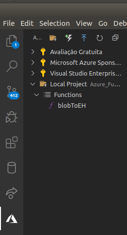
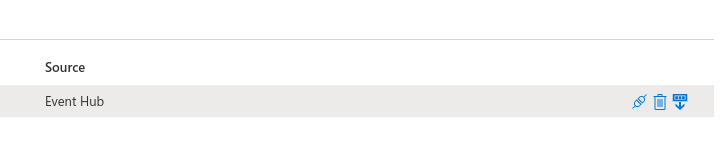

XML Pipeline
===

Azure and Python
---

---
> **Author:** Matheus Willian Machado  
> **Date:** Dez 2, 2020
---

Overview
---

> I've a challenge for you [...]  
> this is the program that I need to build  
> read file from blob storage  
> use Azure Functions with Python library to read the xml  
> send data to Azure Event hubs  
>   
> ```xml
> <?xml version="1.0" encoding="UTF-8" ?>
> <root>
> <EventID>42-5221-120212</EventID>
> <EventKey>DELIVERY_SATISFACTION_EVENT</EventKey>
> <MarketID>US</MarketID>
> <RouteNumber>5221</RouteNumber>
> <BusinessUnit>94202</BusinessUnit>
> <DCNumber>42</DCNumber>
> <RestaurantNumber>7975</RestaurantNumber>
> <RestaurantPhoneNumber>3642493</RestaurantPhoneNumber>
> <PlannedArrival>2020-07-30 05:24:00</PlannedArrival>
> <RealArrival>2020-07-30 04:04:12</RealArrival>
> <DeliverySatisfaction>5</DeliverySatisfaction>
> <Driver>Kirk Black</Driver>
> <SigningManager>carl</SigningManager>
> </root>
> ```
>   
> that's it!  
> is this something would be interested to make?  
> [...]  
> this is the data :slightly_smiling_face:  
> you can read straight  
> give me how many hours you're gonna need to build this and document  
> pipeline will be  
> read xml file from blob storage -> using azure functions with python -> send to Azure event hubs -> capture on Azure Stream Analytics  
> (Luan Moreno)

---

Objectives
---

1. [x] Create a file with the xml example
1. [x] Create an Azure Event Hub (AEH)
1. [x] Create an Azure Stream Analytic (ASA)
1. [x] Create an Azure Function (AF)
1. [x] Implement a function to read data from ABS and send to AEH
1. [x] Integrate ASA to read data from AEH 

---

Arquitecture
---


---

Requirements
---

- Azure Subscription
- Visual Studio Code (VSCode)
- Azure Functions Extension

- Python Extension


---

Step-by-Step
---

### Creating Everything

First step was to create everything that we would need.

#### File example.xml

You can use any text editor to create the xml example, here was used VSCode.


#### Resource Group

In [Azure](https://portal.azure.com), you can create a Resource Groups (RG), so we can organize all the project tools in one place.


#### Event Hub

[Create as well an Event Hub](https://docs.microsoft.com/en-us/azure/event-hubs/event-hubs-create), and we gonna need to [create a send and listen policy](https://docs.microsoft.com/en-us/azure/event-hubs/authorize-access-shared-access-signature) too.


#### Stream Analytics

Next, [create azure stream analytics](https://docs.microsoft.com/en-us/azure/stream-analytics/stream-analytics-quick-create-portal).


#### Azure Functions

Using the VSCode Azure Functions Extension, create a new Project as follows:


Right click this icon  to create an Azure Function from Template.

- Language: Python
- Interpreter: 3.6
- Template: Azure Blob Storage Trigger
- Settings: Create New (and create a new storage account)

After creation, you will be able to see your function as bellow:



You can see the Azure Blob Storage created with the Azure Functions in [Azure Portal](https://portal.azure.com/) on "All Resources" section.

As soon as the function is created, right click on it and select the option "add binding".

- Direction: out
- Binding: Azure Event Hubs
- Name: $return
- Settings: Create new (and select all the settings related to the event hub you created).

Then, check the function.json file, it should look similar to this:


---

Azure Functions
---

Create a container with the name of the path that you set on Azure Function creation, in case of doubt check the function.json file in "path" key. In this case we setted the path to "xml/{name}" so we need to create a "xml" container:


In \_\_init__.py file, change it to look like this:

```python

import logging
from json import dumps
import azure.functions as func


def main(myblob: func.InputStream):
    logging.info(f"Python blob trigger function processed blob \n"
                 f"Name: {myblob.name}\n"
                 f"Blob Size: {myblob.length} bytes")
    xml = myblob.read()
    print(xml)
    return dumps({"xml": xml.decode('utf-8')})

```

To test a function inside VSCode one just need to press f5


Now, let's upload the example.xml so we can test our function. We gonna do this within the portal for easiness.


The function should return something like this:


Note that we asked the function to print the file content as you can see in the image above.  
We just need to check if Azure Function passed the json result to Azure Event Hub, we gonna look it in Azure Portal as well.


As you can see above, there are some activity inside Event Hub.  
Next we'll check it with Stream Analytics.

----

Integrating Event Hubs with Stream Analytics
---

To integrate Event Hub with Stream Analytics, we need to set EH as input. Just follow the steps above.


Once integrated, click on the icon  to request a sample of the data present in the hub and select a time period compatible with your execution. In this case, we'll select one day of data.




When finished download the sample data


And, look! Our example.xml went perfectly through the pipeline!


---


References
---

1. <https://docs.microsoft.com/en-us/azure/storage/blobs/storage-quickstart-blobs-portal>
1. <https://docs.microsoft.com/en-us/azure/event-hubs/event-hubs-create>
1. <https://docs.microsoft.com/en-us/azure/event-hubs/authorize-access-shared-access-signature>
1. <https://docs.microsoft.com/en-us/azure/stream-analytics/stream-analytics-quick-create-portal>
1. <https://docs.microsoft.com/en-us/azure/azure-functions/functions-develop-vs-code?tabs=csharp>

---